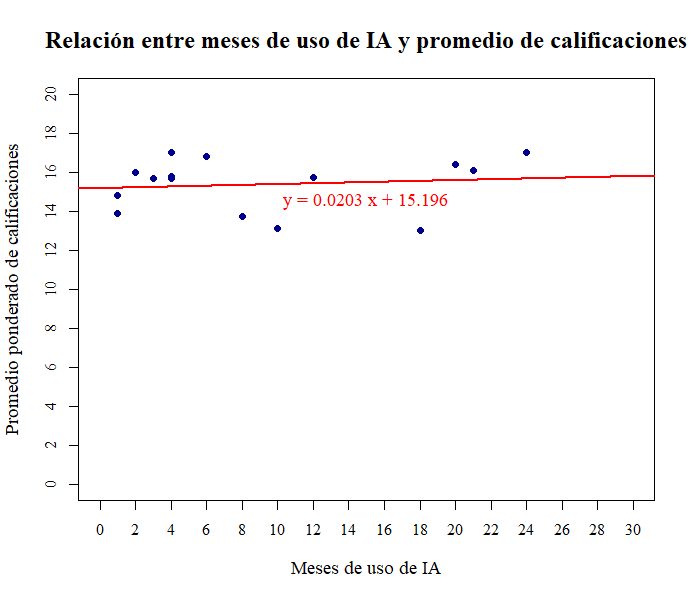

# Impacto del Uso de IA en el Rendimiento Académico

**Versión:** 3.0.0  
**Fecha:** Noviembre 2024

> Análisis en R del estudio “Impacto del uso de inteligencia artificial en el rendimiento académico de estudiantes universitarios en la ciudad de Lima”

## Tabla de Contenidos
1. [Características](#características)  
2. [Requisitos](#requisitos)  
3. [Instalación](#instalación)  
4. [Uso Rápido](#uso-rápido)  
5. [Consideraciones](#consideraciones)  
6. [Limitaciones](#limitaciones)  
7. [Resultados](#resultados)  
8. [Contribuir](#contribuir)  
9. [Agradecimientos](#agradecimientos)  
10. [Licencia](#licencia)  

## Características
- Carga y procesamiento de datos desde Excel (`datos_impacto.xlsx`).  
- Gráfico de barras con la frecuencia de uso de herramientas de IA.  
- Histograma de promedios ponderados de calificaciones (regla de Sturges).  
- Gráfico de dispersión con regresión lineal entre meses de uso de IA y promedio académico.  
- Exportación automática de imágenes a `output/figuras/`.  

## Requisitos
- R ≥ 4.0  
- Paquetes: `readxl`, `ggplot2`, `stringr`, `dplyr`.  
- Archivo de datos: `data/datos_impacto.xlsx`.  

## Instalación
1. Clona el repositorio:  
   ```
   git clone https://github.com/Ferinjoque/impacto-ia-rendimiento-academico-lima.git
   cd impacto-ia-rendimiento-academico-lima
   ```
2. Instala paquetes en R:
   ```
   install.packages(c("readxl","ggplot2","stringr","dplyr"))
   ```
3. Coloca `datos_impacto.xlsx` en la carpeta `data/`.

## Uso Rápido
1. Abre R o RStudio en la carpeta del proyecto.
2. Ejecuta el script principal:
   ```
   source("analysis.R")
   ```
3. Revisa las imágenes generadas en `output/figuras/`.

## Consideraciones
- Asume que la hoja de Excel mantiene la estructura original del estudio.
- El script crea la carpeta `output/figuras/` si no existe.
- Se fija un ancho de 30 caracteres para envolver etiquetas largas.

## Limitaciones
- No valida manualmente la calidad de los datos de entrada.
- El modelo de regresión utiliza datos predefinidos; no extrae automáticamente de la hoja.
- Sólo genera gráficos en formato PNG.

## Resultados


## Contribuir
1. Haz un fork y crea una rama (`git checkout -b feature/mi-mejora`).
2. Realiza tus cambios y haz commit (`git commit -m "Añade función X"`).
3. Envía un pull request a main.

## Agradecimientos
- **Equipo de investigación**: Erick Huamanchumo, Alessandro Juarez, Ana Paula Guzmán y Anaís Huaman.

## Licencia
Este proyecto está bajo la Licencia MIT. Consulta el archivo `LICENSE` para más detalles.
